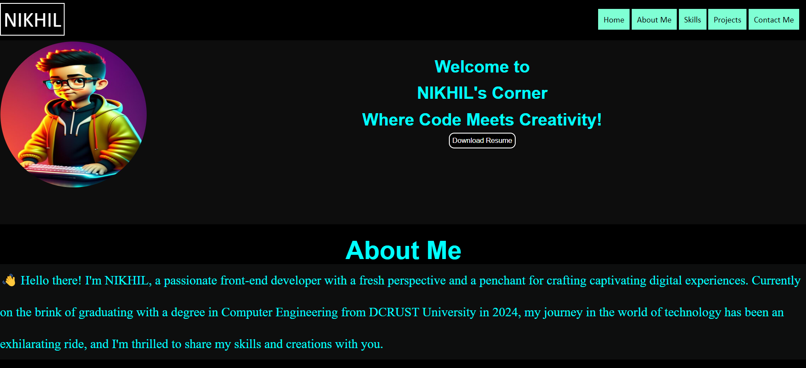

# 🌐 Personal Portfolio Website

A modern, responsive **personal portfolio website** built with **HTML, CSS, and JavaScript**.
This website showcases my skills, projects, and contact information as a front-end developer.

---

## 🚀 Features

* **Landing Section**: Animated introduction with name, title, and resume button
* **Navigation Bar**: Smooth scrolling to different sections
* **Skills Section**: Highlights core web development skills with icons
* **Projects Showcase**: Displays live projects with demo and source code links
* **Contact Section**: Social media links (LinkedIn, GitHub, WhatsApp, Email)
* **Hire Me Form**: Contact form with reset functionality
* **Responsive Design**: Optimized for desktop and mobile

---

## 🛠️ Tech Stack

* **Frontend**:

  * HTML5
  * CSS3 (with animations)
  * JavaScript (form handling & DOM interaction)

* **Assets**:

  * SVG icons for skills
  * PNG images for branding and projects

---

## 📸 Preview



---

## 📂 Project Structure

```
portfolio-website/
│── assets/
│   ├── image/       # Logos, project screenshots
│   ├── svg/         # Skill icons
│── index.html       # Main page
│── style.css        # Styling
│── index.js         # JavaScript logic
│── README.md        # Documentation
```

---

## 🔗 Live Demo

👉 [View Portfolio](https://n4nikhilofficial.github.io/Portfolio/)

---

## 🧑‍💻 Author

👋 Hi, I’m **Nikhil Rana** — a passionate **Front-End Developer** and B.Tech Computer Science student.

* 🌍 [LinkedIn](https://www.linkedin.com/in/n4nikhilofficial)
* 💻 [GitHub](https://github.com/n4nikhilofficial)
* 

---

## 📜 License


👉 Do you want me to also make a **README badge section** (skills like HTML, CSS, JS, GitHub with shields.io icons) so it looks more professional on GitHub?

